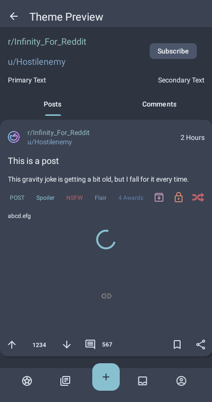
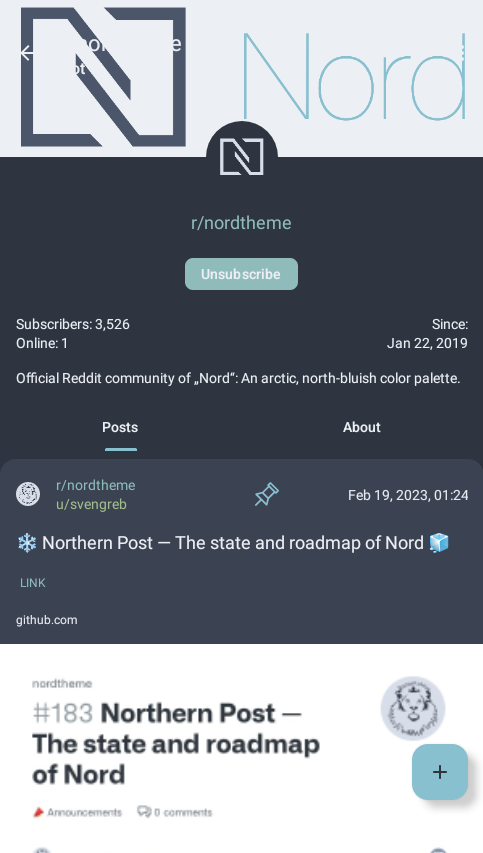
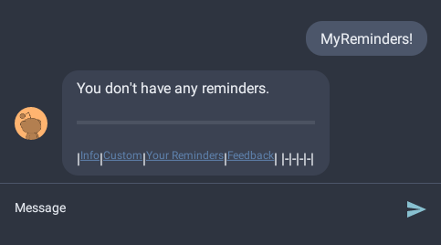

# nord-infinity-for-reddit

A [Nord theme](https://nordtheme.com) port for the [Infinity Reddit client for Android](https://github.com/Docile-Alligator/Infinity-For-Reddit) 🗻

Based on [midnitefox's theme](https://github.com/midnitefox/Nord-Theme-Ports-and-Assets).

## How to use

  * On your phone, copy the contents of the [nord-infinity-for-reddit.jsonc file](https://raw.githubusercontent.com/Berisan/nord-infinity-for-reddit/main/nord-infinity-for-reddit.jsonc) into your clipboard
  * In Infinity, navigate to `Settings` -> `Theme` -> `Manage Themes`
  * Tap the Floating Action Button `+` on the bottom right
  * Select `Import Theme`
  * Infinity should automatically read the theme from your clipboard and use it as the active dark theme

## Screenshots

    
    
    
    

